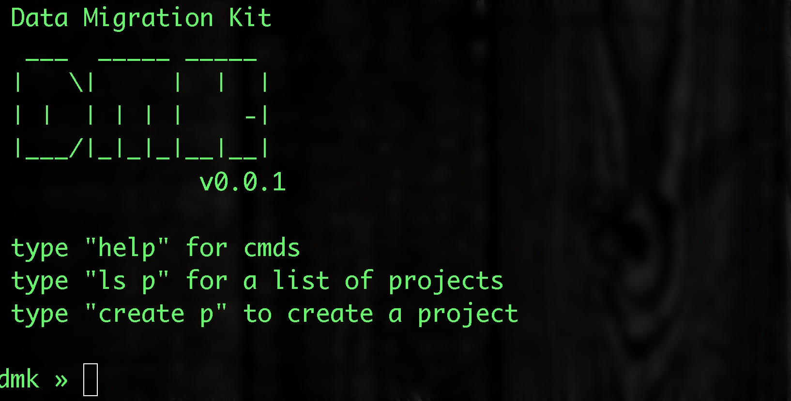

# [WIP] DMK - Data Migration Kit

[](https://travis-ci.org/cjimti/migration-kit)
[](https://goreportcard.com/report/github.com/cjimti/migration-kit)



## Work in Progress

This project is under development.


-------

## Testing

Use `docker-compose` to bring up Cassandra and MySql test databases.

```bash
$ docker-compose up
```

Create example Keyspace and table in Cassandra:

```bash
$ docker run -it --rm -v $(pwd)/dev/cassandra.cql:/setup.cql --net host \
     cassandra cqlsh localhost 39042 -f /setup.cql
```

Use the official Cassandra image to open a `cqlsh` session to
the local Cassandra running from the `docker-compose` above.

```bash
$ docker run -it --rm --net host cassandra cqlsh localhost 39042
```

## Development

Run `go run ./dmk.go`

Use `godep save` after adding any dependencies.


#### Containers

Containers for testing MySql and Cassandra databases.

