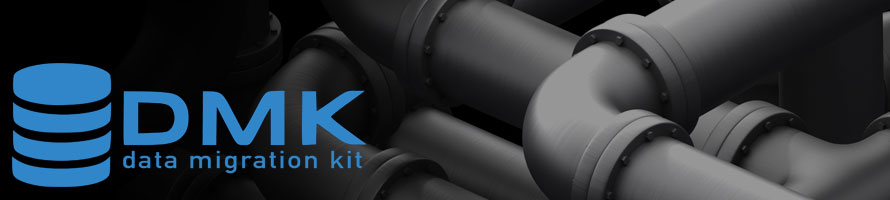

## Work in Progress

This project is under development.

# DMK - Data Migration Kit

[](https://github.com/cjimti/migration-kit/releases)
[](https://travis-ci.org/cjimti/migration-kit)
[](https://goreportcard.com/report/github.com/cjimti/migration-kit)

-------

## Testing

Use `docker-compose` to bring up Cassandra and MySql test databases.

```bash
$ docker-compose up
```

Create example Keyspace and table in Cassandra:

```bash
$ docker run -it --rm -v $(pwd)/dev/cassandra.cql:/setup.cql --net host \
     cassandra cqlsh localhost 39042 -f /setup.cql
```

Use the official Cassandra image to open a `cqlsh` session to
the local Cassandra running from the `docker-compose` above.

```bash
$ docker run -it --rm --net host cassandra cqlsh localhost 39042
```

Run the following example migrations in order:

```bash
go run ./dmk.go -d examples -p example run -v example_csv_to_cassandra
# check: select * from example.migration_data;

go run ./dmk.go -d examples -p example run -v cassandra_to_cassandra_by_name example
# check: select * from example.migration_data_name;

go run ./dmk.go -d examples -p example run -v cassnadra_to_cassandra_name_lookup example
# check: select * from example.migration_name; 

go run ./dmk.go -d examples -p example run -v cassandra_to_cassandra_using_collector example
# check: select * from example.migration_sets;


```
## Todo

- Reuse DB connection for script run sub-migrations.
- Better error messaging (location of error)
- General Performance improvements.

## Development

Run `go run ./dmk.go -d ./examples/`

Use `godep save` after adding any dependencies.


#### Containers

Containers for testing MySql and Cassandra databases.

